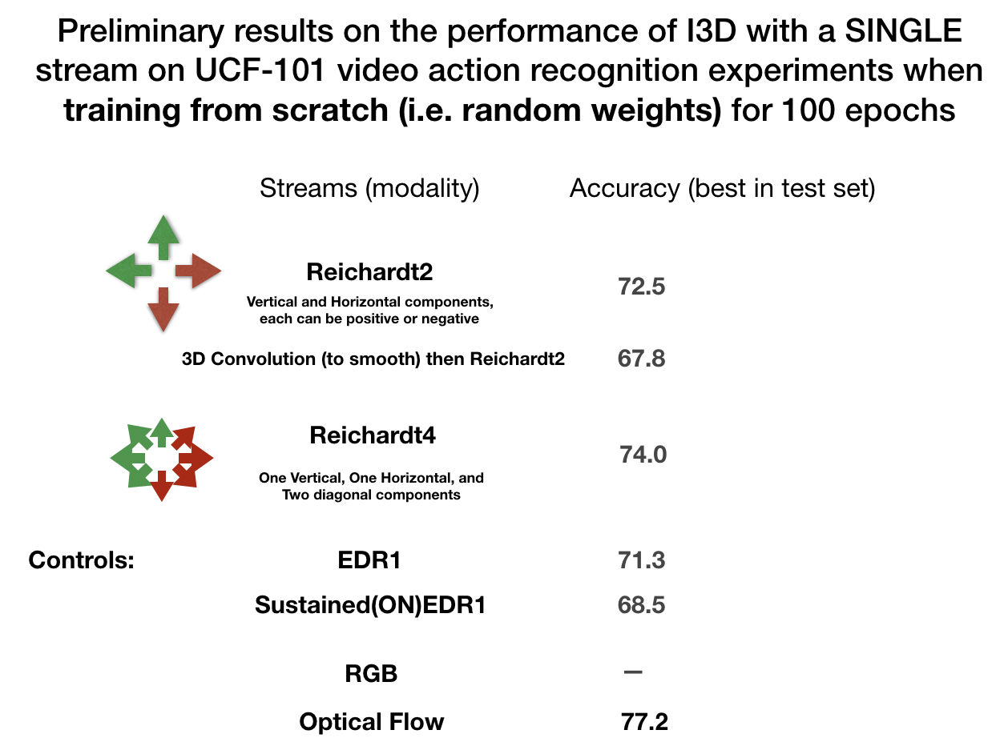

# RetinaInspiredVideoProcessing

These notes are meant to be useful to the next person extending the work on retinally-inspired processing of videos for action recognition.

First, I suggest that scripts such as `ReichardtTest_retina_convert.py` and `PureEDR_retina_convert.py` be used to transform some videos to see the effect of the Reichardt correlator or EDR.

To create an event-driven representation of a video side-by-side with the original video, run:

```
python PureEDR_retina_convert.py --input_path="example_videos/v_Archery_g01_c01.avi" --out_path="Test_EDR.mov"
```

(`v_Archery_g01_c01.avi` is a UCF101 video commonly used to demonstrate EDR)

To create a Reichardt correlator of a video side-by-side with the original video, run:
```
python ReichardtTest_retina_convert.py --input_path="example_videos/v_Archery_g01_c01.avi" --out_path="Test_ReichardtDiagonal2.mov"
```

(The Reichardt demo uses the call:
```
def Reichardt8(video):
    '''
       Returns a tuple of Reichardt-Hassenstein correlators in 8 directions
    '''
    vp1, vm1 = Reichardt_vertical_2channels_Vectorized(video) #Directions 1, -1
    vp3, vm3 = Reichardt_horizontal_2channels_Vectorized(video) #Directions 3, -3
    vp2, vm2 = Reichardt_diagonal1_2channels_Vectorized(video) #Directions 2, -2
    vp4, vm4 = Reichardt_diagonal2_2channels_Vectorized(video) #Directions 4, -4

return vp1, vm1, vp2, vm2, vp3, vm3, vp4, vm4
```
The first diagonal direction (2,-2) corresponds to the SE direction, while the second diagonal direction (4,-4) corresponds to the SW direction, where the convention for the positive y-direction is downwards.
)

Siddharth has a repo on a pytorch implementation of I3D for UCF-101 video action recognition that has options for pre-processing with Optical Flow (OF), EDR or Reichardt: https://github.com/smittal6/i3d

On beast3, my experiments on i3d are under `/home/rhonald/Retina/i3d`

The UCF-101 videos were stored under `/mnt/data1/UCF-101_old/` (currently missing)

A small fraction of the videos were missing pre-computed Optical Flow data.
If you wish to calculate OF from the videos, I suggest that you first try
https://github.com/agethen/dense-flow

(I was able to install and successfully use it in beast1
```
/home/rhonald/agethen2/dense-flow
```
Run `bash build-flow.sh`
the locations of videos are in the file `files.txt`
input videos and results are in example_videos under `/home/rhonald/agethen2/dense-flow/example_videos`)

We kept a spreadsheet to compare the performance of different retinally-inspired video transformations together with the commandline arguments passed to the i3d scripts (which were run with CUDA on beast3.bdc.bcm.edu): https://docs.google.com/spreadsheets/d/1S2Qb1E3a6jRwpmNY7_TuHdeCRzgPuqV4pldVhNZSK6k/edit?ts=5b326def#gid=1130522074

BTW, we had been using tmux sessions to run one or more of these video recognition experiments.

For what accuracy to expect, when training with initial weights from scratch:




Optical Flow has better accuracy than either EDR or Reichardt, but one thing we would like to understand better is how to get the accuracy of EDR or Reichardt to be closer to that of OF when not starting from scratch and fine-tuning the network weights.
